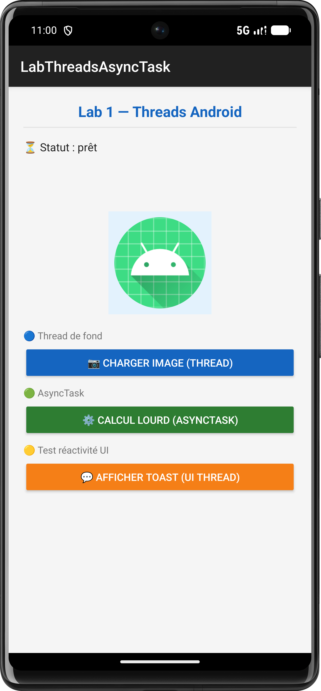
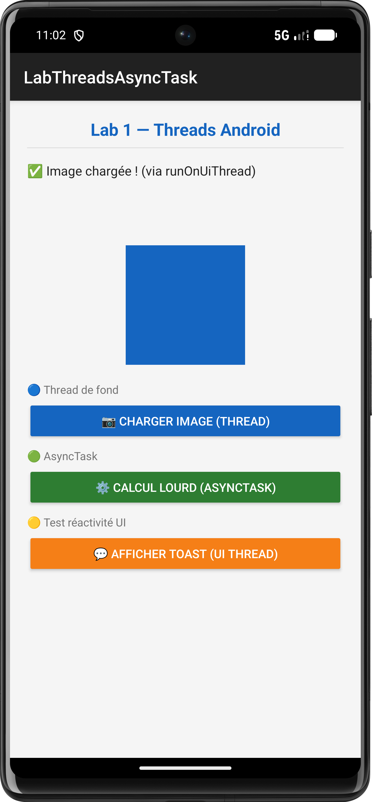
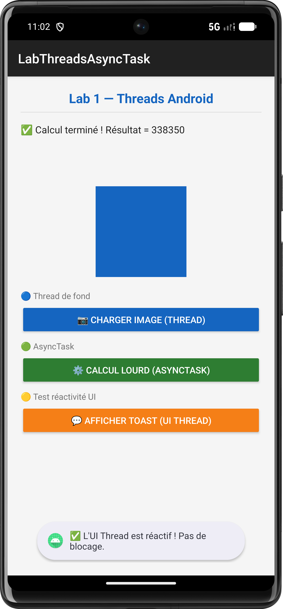

# Lab 1 — Threads Android : UI Thread vs Worker Thread

> Module : Programmation Mobile Android  
> Sujet : Gestion des threads, AsyncTask, et réactivité de l'interface

---

## 📱 Aperçu de l'application

| Page principale | Chargement image | Afficher Toast |
|:---:|:---:|:---:|
|  |  |  |
| Écran d'accueil avec les 3 boutons | Thread de fond — image chargée | Toast affiché sans bloquer l'UI |

---

## 📋 Objectif du lab

Comprendre et démontrer la différence entre le **UI Thread** (thread principal) et les **Worker Threads** (threads de fond), et savoir comment mettre à jour l'interface depuis un thread secondaire.

---

## 💡 Concepts clés

| Concept | Rôle | Peut modifier les vues ? |
|---|---|---|
| **UI Thread** | Gère l'affichage et les clics | ✅ Oui |
| **Worker Thread** | Calculs lourds, réseau | ❌ Non |
| **AsyncTask** | Worker Thread + retour automatique sur UI | ✅ Via `onPostExecute` |

### Méthodes pour revenir sur le UI Thread

```java
// Méthode 1 — via la vue
view.post(() -> { /* code UI */ });

// Méthode 2 — via l'Activity
runOnUiThread(() -> { /* code UI */ });

// Méthode 3 — via Handler
new Handler(Looper.getMainLooper()).post(() -> { /* code UI */ });
```

### Structure d'un AsyncTask

```java
class MonTask extends AsyncTask<Void, Integer, String> {

    @Override
    protected void onPreExecute() {
        // UI Thread — avant le traitement
    }

    @Override
    protected String doInBackground(Void... params) {
        // Worker Thread — traitement long
        publishProgress(50); // envoie la progression
        return "résultat";
    }

    @Override
    protected void onProgressUpdate(Integer... values) {
        // UI Thread — mise à jour de la progression
        progressBar.setProgress(values[0]);
    }

    @Override
    protected void onPostExecute(String result) {
        // UI Thread — traitement terminé
    }
}
```

---

## 🗂️ Structure du projet

```
LabThreadsAsyncTask/
├── app/
│   ├── src/main/
│   │   ├── java/com/example/labthreadsasynctask/
│   │   │   └── MainActivity.java       <- Logique principale
│   │   ├── res/
│   │   │   ├── layout/
│   │   │   │   └── activity_main.xml   <- Interface XML
│   │   │   └── values/
│   │   │       ├── colors.xml
│   │   │       └── strings.xml
│   │   └── AndroidManifest.xml
│   └── build.gradle.kts
├── screenshots/
│   ├── page_principale.png             <- Ecran d'accueil
│   ├── charger_image.png               <- Thread en action
│   └── affiche_toast.png               <- Toast UI Thread
└── README.md
```

---

## ▶️ Lancer le projet

### Prérequis
- Android Studio (Hedgehog ou plus récent)
- JDK 8+
- Android SDK API 21+

### Étapes

```bash
# 1. Cloner le dépôt
git clone https://github.com/TON_USERNAME/LabThreadsAsyncTask.git

# 2. Ouvrir dans Android Studio
File → Open → sélectionner le dossier lab1-threads-android

# 3. Sync Gradle
Android Studio → Sync Project with Gradle Files

# 4. Lancer sur émulateur ou appareil réel
Run → Run 'app'  (Shift + F10)
```

---

## 🧪 Validation — Checklist des tests

| # | Test | Résultat attendu |
|---|---|---|
| 1 | Cliquer **Charger image (Thread)** | Statut change, bouton désactivé 3 s |
| 2 | Pendant le chargement, cliquer **Afficher Toast** | Le Toast s'affiche immédiatement → UI non bloquée ✅ |
| 3 | Après 3 s | L'image change de couleur, bouton réactivé |
| 4 | Cliquer **Calcul lourd (AsyncTask)** | La ProgressBar démarre de 0 → 100 % |
| 5 | Pendant l'AsyncTask, cliquer **Afficher Toast** | Le Toast s'affiche → UI non bloquée ✅ |
| 6 | À 100 % | Toast "Calcul terminé" + barre masquée |

---

## ⚠️ Erreurs courantes

### CalledFromWrongThreadException
```
android.view.ViewRootImpl$CalledFromWrongThreadException:
Only the original thread that created a view hierarchy can touch its views.
```
**Cause** : modification d'une vue depuis un Worker Thread directement.  
**Solution** : utiliser `runOnUiThread()`, `view.post()` ou `Handler`.

### ANR — Application Not Responding
**Cause** : traitement long exécuté sur le UI Thread (ex : `Thread.sleep()` dans `onCreate()`).  
**Solution** : déplacer le traitement dans un Worker Thread ou AsyncTask.

---

## 📝 Notes pédagogiques

- `AsyncTask` est **déprécié** depuis Android API 30 (Android 11), mais reste utilisé en cours pour comprendre les concepts. En production, utiliser `ExecutorService` ou les Coroutines Kotlin.
- Le bouton **Afficher Toast** est le "témoin" : s'il répond pendant un traitement, c'est que l'UI Thread n'est pas bloqué.

---

## 👤 Auteur

- **Nom** : _zakaria aouinati_  
- **Module** : Programmation Mobile Android  
- **Lab** : 1 — Threads & AsyncTask
